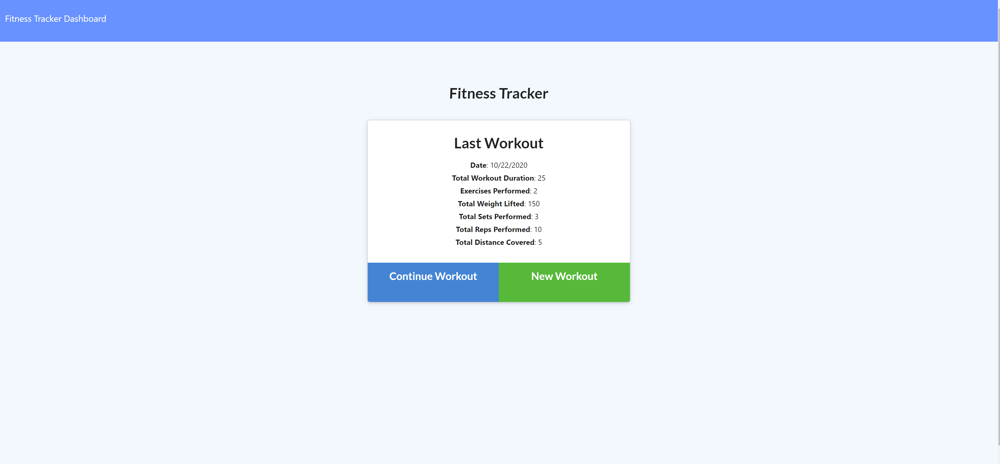
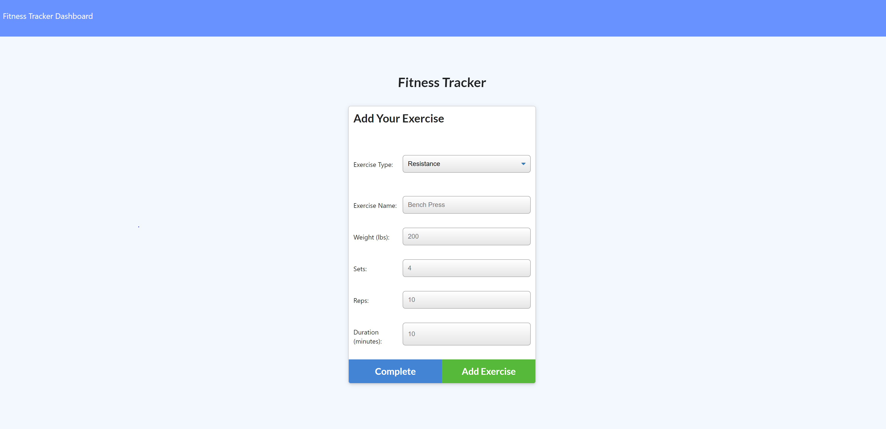
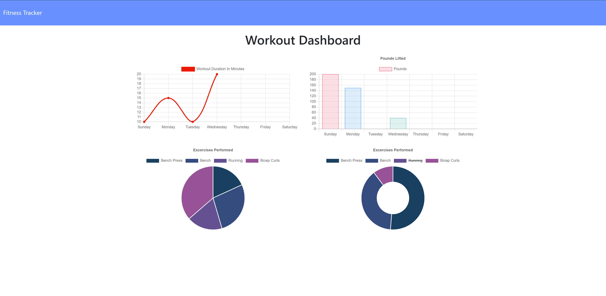

# my-fitness-lens

## Table of Contents

- [Description](#Description)
- [Tools_Used](#Tools_Used)
- [Links](#Links)
- [Application-Screen-Shots](#Application-Screen-Shots)
- [Credits](#Credits)

## Description

My-Fitness-Lens allows users to view, create, and track daily workouts. It allows users to log multiple exercises in a workout on a given day. Additionally, it allows users to track the name, type, weight, sets, reps and duration of exercise. Furthermore, if the exercise is a cardio exercise, it allows the user to track the distance he or she traveled.

## Tools Used

- HTML
- CSS
- JavaScript
- Bootstrap
- jQuery
- Express
- Mongoose Schema
- MongoDB
- MVC

## Links (Application & Repo)

My-Fitness-Lens can be accessed at heroku link provided below:

Heroku Pages URL: <https://my-fitness-lens.herokuapp.com/>

Github Repository: <https://github.com/rajdeep24/NoteTaker>

### Screenshots

#### Homepage

#### Add Exercise

#### Dashboard

## Credits

I would like to credit georgia tech's coding bootcamp and the support from my peers.

## Badges

